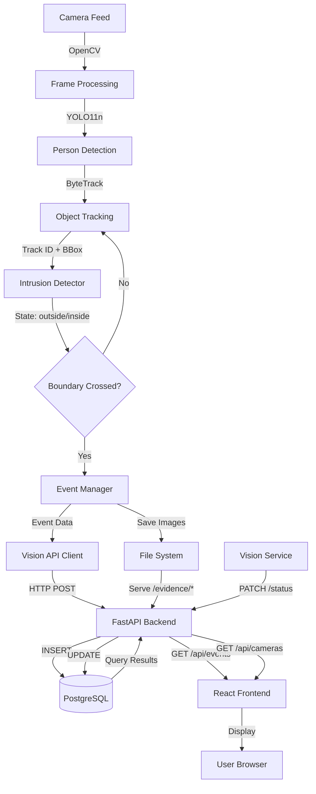

# lookOut

An AI-powered home security monitoring system that detects people, tracks movement across virtual boundaries, captures evidence, and provides a real-time web dashboard for security event management.

## Overview

lookOut combines computer vision, object tracking, and web technologies to create an intelligent security monitoring solution. The system uses YOLO11n for person detection, ByteTrack for multi-object tracking, and virtual boundary detection to identify security intrusions. When a tracked person crosses a configured boundary, the system automatically captures full-frame and cropped evidence images, stores event metadata in a PostgreSQL database, and displays real-time information through a React dashboard.

### What Problem Does lookOut Solve?

Traditional security camera systems generate hours of footage that must be manually reviewed. lookOut automates intrusion detection by:
- Detecting people in camera feeds using state-of-the-art AI
- Tracking individuals across frames with unique IDs
- Triggering alerts only when specific security boundaries are crossed
- Capturing timestamped evidence automatically
- Providing a clean web interface for event review and camera management

### Current MVP Capabilities

The current implementation provides:
- Real-time person detection and tracking from camera feeds
- Virtual boundary intrusion detection with track-based state management
- Automatic evidence capture (full frame + person crop)
- RESTful API for event and camera management
- PostgreSQL database for persistent storage
- Multi-camera data architecture (backend/database/frontend)
- React dashboard for viewing events and monitoring cameras
- Dockerized backend and database deployment
- Automated testing and CI/CD pipeline

## Key Features

### Computer Vision & Detection
- ✅ **Real-time person detection** using YOLO11n
- ✅ **Multi-object tracking** with ByteTrack
- ✅ **Track-based state management** (outside → inside transitions)
- ✅ **Virtual boundary intrusion detection**
- ✅ **Feet position calculation** for accurate boundary evaluation

### Evidence Capture
- ✅ **Full-frame evidence** capture on intrusion
- ✅ **Cropped person evidence** extraction from bounding boxes
- ✅ **Timestamped file naming** for easy retrieval
- ✅ **Filesystem-based storage** (recordings/intrusions/)

### Backend API
- ✅ **FastAPI REST API** with automatic OpenAPI documentation
- ✅ **PostgreSQL database** with cameras and intrusion_events tables
- ✅ **Camera registration and management** (POST, GET, PATCH)
- ✅ **Event creation and retrieval** with camera relationship (LEFT JOIN)
- ✅ **Camera status tracking** (online/offline, running/offline)
- ✅ **Vision service status updates** via PATCH endpoint

### Frontend Dashboard
- ✅ **React 19** + React Router for SPA navigation
- ✅ **Dashboard page** with statistics and recent events
- ✅ **Events page** with filtering (All/Today) and search by Track ID
- ✅ **Cameras page** displaying all registered cameras with live status
- ✅ **Event cards** showing intrusion details, camera info, and evidence
- ✅ **Evidence viewing** (crop preview + full-frame link)
- ✅ **Dark security-themed UI** with professional styling
- ✅ **Responsive design** for desktop and mobile

### Engineering & DevOps
- ✅ **Docker Compose** orchestration for backend + database
- ✅ **Automated testing** with pytest (vision + backend)
- ✅ **GitHub Actions CI** running tests and Docker builds
- ✅ **ESLint** for frontend code quality
- ✅ **Environment-based configuration** (.env files)

## System Architecture



### Application Components

**1. Vision Service** (`vision/`)
- **Language**: Python 3.11
- **Libraries**: Ultralytics YOLO11n, OpenCV, ByteTrack, requests
- **Purpose**: Captures camera frames, detects people, tracks objects, evaluates boundary crossings, captures evidence, and communicates with backend API
- **Execution**: Runs locally to access camera hardware (not containerized for camera access)

**2. Backend API** (`backend/`)
- **Framework**: FastAPI + Uvicorn
- **Database**: PostgreSQL 16 with psycopg2
- **Purpose**: RESTful API for camera/event CRUD operations, serves evidence images via static file mount
- **Deployment**: Dockerized with health checks and volume mounting

**3. Frontend Dashboard** (`frontend/`)
- **Framework**: React 19 + Vite
- **Routing**: React Router DOM
- **Styling**: CSS (no frameworks)
- **Purpose**: Web interface for viewing events, monitoring cameras, and accessing evidence
- **Development**: Vite dev server (npm run dev)

### Communication Flow

- **Vision → Backend**: HTTP POST/PATCH with JSON payloads
- **Backend → Database**: SQL queries via psycopg2
- **Frontend → Backend**: HTTP GET/POST via Fetch API
- **Backend → Frontend**: JSON responses with event/camera data
- **Evidence Serving**: Static file mount at `/evidence/*` endpoint

## How Intrusion Detection Works

1. **Frame Capture**: OpenCV reads frames from the configured camera source
2. **Person Detection**: YOLO11n detects people in each frame (class 0)
3. **Object Tracking**: ByteTrack assigns persistent Track IDs to detected people
4. **Position Calculation**: System calculates feet position (bottom-center of bounding box)
5. **State Determination**: Each track is classified as "outside" or "inside" the boundary
6. **State Tracking**: `IntrusionDetector` maintains previous state for each Track ID
7. **Intrusion Detection**: An **outside → inside** state transition triggers intrusion
8. **Evidence Capture**: 
   - Full camera frame saved as `intrusion_YYYY-MM-DD_HH-MM-SS_id-{track_id}_full.jpg`
   - Person crop saved as `intrusion_YYYY-MM-DD_HH-MM-SS_id-{track_id}_crop.jpg`
9. **API Communication**: Vision service sends event data to FastAPI via POST
10. **Database Persistence**: Backend stores event metadata with camera relationship
11. **Dashboard Display**: React frontend fetches and renders events with evidence links

### Important Note on Track IDs

**Track ID ≠ Person Identity**

A ByteTrack Track ID identifies a tracked object during the tracking session. It is:
- ✅ Persistent across frames while the person remains in view
- ✅ Useful for detecting boundary crossings
- ❌ **NOT** a person identification system
- ❌ **NOT** face recognition

If the same person leaves and re-enters, they will receive a **new Track ID**. Face recognition is not part of the current MVP.

## Multi-Camera Architecture

### Database & API Support

The system is architecturally designed to support multiple cameras:

- **Database**: `cameras` table stores camera metadata (id, name, source, location, status, vision_status, detection_model, tracking, is_enabled)
- **Foreign Key**: `intrusion_events.camera_id` references `cameras.id`
- **API Endpoints**: Full CRUD support for camera registration and management
- **Frontend**: Cameras page displays all registered cameras with real-time status updates

### Current Vision Processing

**Single-Stream Processing**: The current `vision/src/main.py` processes **one camera stream per execution**. Camera ID and source are configured as constants:

```python
CAMERA_ID = 1
CAMERA_SOURCE = 1  # 0 for default webcam, or video file path
```

To monitor multiple cameras simultaneously, run multiple vision processes with different configurations (future enhancement).

### Future: Multi-Stream Vision Workers

Simultaneous multi-camera YOLO inference across multiple streams is **planned future work** and not currently implemented.

## Project Structure

```
lookout-ai/
├── backend/
│   ├── app/
│   │   ├── main.py           # FastAPI application and routes
│   │   ├── database.py       # PostgreSQL connection and schema
│   │   └── storage.py        # Storage utilities (S3 ready)
│   ├── tests/
│   │   └── test_health.py    # Backend API tests
│   ├── Dockerfile            # Backend container definition
│   └── requirements.txt      # Python dependencies
├── vision/
│   ├── src/
│   │   ├── main.py           # Vision service entry point
│   │   ├── detector.py       # YOLO11n + ByteTrack detector
│   │   ├── intrusion.py      # Boundary detection logic
│   │   ├── event_manager.py  # Evidence capture and file management
│   │   └── api_clients.py    # Backend API communication
│   ├── tests/
│   │   └── test_intrusion.py # Intrusion detection unit tests
│   ├── Dockerfile            # Vision container definition
│   └── requirements.txt      # Python dependencies
├── frontend/
│   ├── src/
│   │   ├── api/              # API client modules
│   │   ├── components/       # React components (Header, Sidebar, EventCard, etc.)
│   │   ├── pages/            # Page components (Dashboard, Events, Camera)
│   │   ├── utils/            # Utility functions (date formatting, stats)
│   │   ├── App.jsx           # Root component with routing
│   │   └── main.jsx          # React entry point
│   ├── public/               # Static assets
│   ├── package.json          # npm dependencies and scripts
│   └── vite.config.js        # Vite configuration
├── recordings/
│   └── intrusions/           # Evidence images (full + crop)
├── .github/
│   └── workflows/
│       └── ci.yml            # GitHub Actions CI pipeline
├── docker-compose.yml        # Backend + PostgreSQL orchestration
├── .gitignore                # Git ignore rules
├── .env                      # Environment variables (not committed)
└── yolo11n.pt                # YOLO11n model weights
```

## API

The FastAPI backend provides a RESTful API for camera and event management. Interactive API documentation is available at `http://localhost:8000/docs` when running locally.

### Endpoints

#### Health & Status
- `GET /` - Root endpoint, returns service info
- `GET /health` - Health check endpoint

#### Camera Management
- `GET /api/cameras` - List all registered cameras
- `POST /api/cameras` - Register a new camera
  - Body: `{name, source, location?}`
- `PATCH /api/cameras/{camera_id}/status` - Update camera status
  - Body: `{status, vision_status}`
  - Used by vision service to report online/offline and running/offline states

#### Event Management
- `GET /api/events` - List all intrusion events (with LEFT JOIN to cameras)
  - Returns: event details + camera_name + camera_location (null for historical events without camera)
- `POST /api/events` - Create a new intrusion event
  - Body: `{event_type, track_id, detected_at, image_path, crop_path, camera_id}`

#### Evidence Access
- `GET /evidence/{filename}` - Serve evidence images via static file mount
  - Example: `/evidence/intrusion_2026-09-30_11-52-02_id-26_crop.jpg`

## Database

### Schema

**`cameras` table**
```sql
CREATE TABLE cameras (
    id SERIAL PRIMARY KEY,
    name VARCHAR(100) NOT NULL,
    source TEXT NOT NULL,
    location VARCHAR(100),
    is_enabled BOOLEAN NOT NULL DEFAULT TRUE,
    status VARCHAR(20) NOT NULL DEFAULT 'offline',
    vision_status VARCHAR(20) NOT NULL DEFAULT 'offline',
    detection_model VARCHAR(50) NOT NULL DEFAULT 'YOLO11n',
    tracking VARCHAR(50) NOT NULL DEFAULT 'ByteTrack',
    created_at TIMESTAMPTZ NOT NULL DEFAULT NOW()
);
```

**`intrusion_events` table**
```sql
CREATE TABLE intrusion_events (
    id SERIAL PRIMARY KEY,
    event_type VARCHAR(50) NOT NULL,
    track_id INTEGER NOT NULL,
    detected_at TIMESTAMPTZ NOT NULL,
    image_path TEXT,
    crop_path TEXT,
    camera_id INTEGER REFERENCES cameras(id)
);
```

### Relationships

- **One-to-Many**: `cameras.id` → `intrusion_events.camera_id`
- **LEFT JOIN**: Event queries use LEFT JOIN to preserve historical events where `camera_id` is NULL
- **Referential Integrity**: Foreign key constraint maintains data consistency

## Local Development

### Prerequisites

- **Python 3.11** or higher
- **Node.js 18+** and npm
- **Docker Desktop** (for backend + database)
- **Git**
- **Compatible camera/webcam** or video file for testing

### Clone Repository

```bash
git clone https://github.com/fahad15fede/lookOut.git
cd lookOut
```

### Environment Configuration

Create environment files from examples:

```bash
# Root .env for Docker Compose
cp .env.example .env
# Edit .env with your PostgreSQL credentials

# Frontend .env
cp frontend/.env.example frontend/.env
# Default: VITE_API_URL=http://localhost:8000
```

**Root `.env` example:**
```env
POSTGRES_DB=lookout
POSTGRES_USER=lookout_user
POSTGRES_PASSWORD=your_secure_password
DATABASE_URL=postgresql://lookout_user:your_secure_password@db:5432/lookout
```

### Start Backend + Database

Use Docker Compose to start FastAPI backend and PostgreSQL:

```bash
docker compose up --build
```

Services will be available at:
- Backend API: `http://localhost:8000`
- API Docs: `http://localhost:8000/docs`
- PostgreSQL: `localhost:5434` (mapped from container port 5432)

### Register a Camera

Before starting the vision service, register a camera in the database:

**Option 1: Using API docs** (`http://localhost:8000/docs`)
- Navigate to POST /api/cameras
- Execute with body: `{"name": "Dev Camera", "source": "0", "location": "Dev Laptop"}`
- Note the returned `id` (use this as CAMERA_ID in vision)

**Option 2: SQL insert**
```sql
INSERT INTO cameras (name, source, location) 
VALUES ('Dev Camera', '0', 'Dev Laptop');
```

### Start Vision Service

**Install Python dependencies:**

```bash
# Windows
python -m venv .venv
.venv\Scripts\activate
pip install -r vision/requirements.txt

# Linux/Mac
python -m venv .venv
source .venv/bin/activate
pip install -r vision/requirements.txt
```

**Download YOLO11n model** (if not present):

The model will be automatically downloaded by Ultralytics on first run, or manually:

```bash
# Place yolo11n.pt in project root
```

**Configure camera** in `vision/src/main.py`:

```python
CAMERA_ID = 1          # Camera ID from database
CAMERA_SOURCE = 0      # 0 = default webcam, 1 = external, or video file path
```

**Run vision service:**

```bash
# From project root
python vision/src/main.py
```

Press `q` in the OpenCV window to stop gracefully.

### Start Frontend

```bash
cd frontend
npm install
npm run dev
```

Frontend will be available at `http://localhost:5173`

### Access the Dashboard

Navigate to:
- **Dashboard**: `http://localhost:5173/`
- **Events**: `http://localhost:5173/events`
- **Cameras**: `http://localhost:5173/cameras`

## Testing

### Vision Tests

```bash
pytest vision/tests -v
```

Tests cover:
- Intrusion state detection (outside/inside)
- State transition logic (outside → inside triggers intrusion)
- Per-track state isolation

### Backend Tests

```bash
pytest backend/tests -v
```

Tests cover:
- Health check endpoint
- API response validation

### Frontend Linting & Build

```bash
cd frontend
npm run lint
npm run build
```

## Docker

### Current Docker Setup

**Containerized**:
- ✅ FastAPI backend (Uvicorn server)
- ✅ PostgreSQL 16 database

**Not Containerized** (runs locally):
- ❌ Vision service (requires camera access)
- ❌ Frontend (Vite dev server for development)

### Docker Compose Services

```yaml
services:
  db:          # PostgreSQL 16
  backend:     # FastAPI + Uvicorn
```

**Backend container**:
- Exposes port 8000
- Mounts `recordings/` volume (read-only) for evidence serving
- Depends on database health check

**Vision service** has a Dockerfile but is typically run locally for camera hardware access during development.

## CI/CD

### GitHub Actions Pipeline

`.github/workflows/ci.yml` runs on push/PR to main:

**Jobs:**
1. **vision-tests**: 
   - Python 3.11 setup
   - Install vision dependencies
   - Run pytest on vision/tests

2. **docker-build**:
   - Build vision Docker image
   - Run tests inside container
   - Validates containerized vision build

**Current Status**: ✅ Continuous Integration (automated testing)

**Not Implemented**: Continuous Deployment (CD) to production environments

## Current Limitations

1. **Single-Stream Vision Processing**: The vision service processes one camera stream per execution. Multi-stream simultaneous processing requires running multiple processes.

2. **Camera Configuration**: Camera ID and source are hardcoded constants in `vision/src/main.py`. Configuration file/environment variable system is future work.

3. **Camera Health Monitoring**: If vision crashes, camera status can become stale. Heartbeat/last_seen tracking is not yet implemented.

4. **Live Streaming**: React dashboard does not display live camera feeds. Evidence viewing is limited to captured images.

5. **Face Recognition**: ByteTrack IDs are object tracking IDs, not person identities. Face recognition for trusted-person identification is not implemented.

6. **Pose Detection**: Advanced detections (climbing, loitering, falling) are not part of current MVP.

7. **Production Security**: Authentication, authorization, HTTPS, and security hardening are development priorities for production deployment.

8. **Evidence Storage**: Evidence is stored in local filesystem (`recordings/`). Cloud storage integration (S3-ready via boto3) is prepared but not active.

9. **Scalability**: Database queries use basic SQL without indexing optimization or caching layers.

10. **Boundary Configuration**: Virtual boundary is hardcoded (`boundary_y=350`). UI-based boundary drawing is future work.

## Roadmap

**Future enhancements** (not currently implemented):

- 🔄 **Heartbeat/Last-Seen**: Camera health monitoring with periodic pings
- 🔄 **Configuration System**: File/env-based camera and boundary configuration
- 🔄 **Multi-Stream Vision Workers**: Simultaneous processing of multiple camera feeds
- 🔄 **Live Streaming**: WebRTC or HLS streaming in React dashboard
- 🔄 **Face Recognition**: Trusted person identification to reduce false positives
- 🔄 **Pose/Activity Detection**: Climbing, loitering, falling detection
- 🔄 **Cloud Evidence Storage**: S3/Azure Blob integration for persistent evidence
- 🔄 **Authentication**: User accounts, roles, and access control
- 🔄 **Production Deployment**: Docker orchestration, HTTPS, reverse proxy
- 🔄 **Mobile App**: Native mobile application for notifications
- 🔄 **Notification System**: Email/SMS/push alerts on intrusion
- 🔄 **Advanced Analytics**: Event patterns, heatmaps, reporting
- 🔄 **Edge Deployment**: Raspberry Pi / NVIDIA Jetson optimization
- 🔄 **Expanded Testing**: Integration tests, E2E tests, increased coverage

## Security & Responsible Use

lookOut is designed as a **security monitoring and alerting system** to assist humans in reviewing security events. AI detections provide evidence and alerts for human decision-making rather than taking automated high-stakes actions.

**Responsible Use Guidelines**:
- Review AI detections before taking action
- Use in compliance with local privacy and surveillance laws
- Inform individuals when under camera surveillance where legally required
- Secure camera feeds and stored evidence appropriately
- Do not rely solely on automated detections for critical security decisions

## Author

**Muhammad Fahad Pervez**

GitHub: [github.com/fahad15fede/lookOut](https://github.com/fahad15fede/lookOut)

---

**License**: Not specified (add LICENSE file for clarity)

**Contributions**: Open to issues and pull requests
